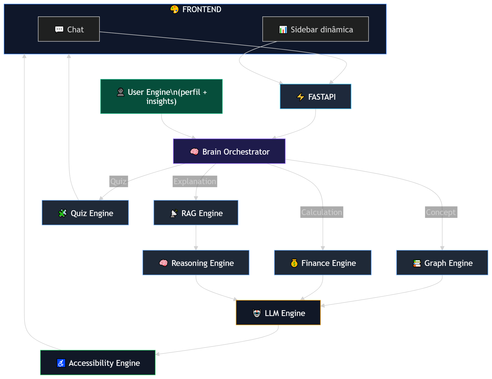

<p align="center">
  
</p>


# BIA PRO

## The Financial Brain that Thinks With You

> Um agente de IA que não apenas responde…
> **ele raciocina, ensina e evolui com o usuário.**

---


Projeto desenvolvido para o desafio DIO-Bradesco de IA aplicada a finanças.

O **Bia PRO** é um agente inteligente de educação financeira que combina:

* **grafo de conhecimento financeiro**
* **IA conversacional**
* **educação financeira personalizada**
* **análise de hábitos financeiros**
* **gamificação e quizzes**
* **acessibilidade digital**

O objetivo do projeto é criar um **assistente financeiro educativo capaz de explicar conceitos econômicos, ajudar usuários a entender suas finanças e promover educação financeira de forma inclusiva e interativa.**

---

# 🚀 Diferencial do Projeto

O maior diferencial do projeto é o **BIA Brain**, um grande **grafo de conhecimento financeiro estruturado**.

Esse cérebro financeiro contém aproximadamente:

```text
~1200 conceitos financeiros
~8000 relações entre conceitos
```

Os conceitos abrangem áreas como:

* Finanças pessoais
* Investimentos
* Crédito
* Risco
* Macroeconomia
* Mercado de capitais
* Estratégias de investimento
* Comportamento financeiro

As relações permitem que o sistema realize **raciocínio financeiro explicável**.

Exemplo de cadeia de raciocínio:

```text
inflação
   ↓
juros
   ↓
renda fixa
   ↓
estratégia de portfólio
```

Isso permite que o agente explique **cadeias econômicas completas**, algo que assistentes tradicionais não conseguem fazer.

---

# 🎯 Objetivos do Projeto

O projeto busca resolver três desafios principais:

### 1️⃣ Educação financeira acessível

Muitas pessoas têm dificuldade em compreender conceitos financeiros importantes.

O agente atua como um **mentor financeiro digital**, explicando conceitos de forma clara e adaptada ao perfil do usuário.

---

### 2️⃣ IA explicável

Diferente de assistentes baseados apenas em IA generativa, o sistema utiliza um **grafo estruturado de conhecimento**.

Isso permite:

* reduzir alucinações
* explicar o raciocínio financeiro
* mostrar relações entre conceitos.

---

### 3️⃣ Educação financeira interativa

O sistema utiliza **gamificação e quizzes** para tornar o aprendizado mais envolvente.

Usuários podem:

* testar seus conhecimentos
* evoluir em níveis de aprendizado
* explorar conceitos financeiros de forma interativa.

---

# 🧩 Funcionalidades

## 🧠 BIA Brain (Knowledge Graph)

O núcleo do sistema é o **Financial Brain**, um grafo de conhecimento financeiro com:

```text
≈1200 conceitos
≈8000 relações
```

Esse grafo permite:

* raciocínio econômico
* explicações estruturadas
* navegação entre conceitos financeiros
* visualização de conexões entre temas.

---

## 📚 Educação Financeira Inteligente

O agente responde perguntas como:

* "O que é inflação?"
* "Por que juros afetam investimentos?"
* "Qual a relação entre risco e retorno?"

As respostas são baseadas em conceitos armazenados na base de conhecimento, reduzindo **alucinações de IA**.

---

## 🎮 Quizzes e Gamificação

Para tornar o aprendizado mais envolvente, o sistema inclui:

* quizzes sobre conceitos financeiros
* trilhas de aprendizado
* desafios educacionais
* progressão de conhecimento.

Isso transforma a educação financeira em uma **experiência interativa**.

---

## 👥 Personalização por Perfil

O agente adapta a comunicação de acordo com o usuário.

Perfis suportados:

```text
Teen
Adulto
Idoso
```

E níveis de conhecimento:

```text
Iniciante
Intermediário
Avançado
```

---

## 🧑‍🎓 Modo Teen (Fidelização de Jovens Clientes)

O **modo Teen** foi projetado para ajudar instituições financeiras a **educar e fidelizar correntistas jovens**.

Nesse modo:

* conceitos financeiros são explicados de forma mais simples
* exemplos são adaptados para o cotidiano de jovens
* a gamificação é utilizada para incentivar aprendizado.

Isso permite que bancos e fintechs **construam relacionamento com clientes desde cedo**, promovendo educação financeira responsável.

---

## 💰 Análise de Hábitos Financeiros

O sistema pode analisar dados simples de gastos do usuário e gerar insights como:

```text
Você gastou 30% da renda em lazer.
O recomendado geralmente é entre 10% e 20%.
```

Isso ajuda o usuário a compreender melhor seus hábitos financeiros.

---

## ♿ Acessibilidade e Inclusão

O projeto também foi pensado com foco em **inclusão digital**.

Funcionalidades planejadas incluem:

* interface em **alto contraste**
* suporte a **Libras (Língua Brasileira de Sinais)**
* linguagem simplificada para usuários com menor letramento financeiro
* comunicação estruturada para **usuários neurodivergentes**

O objetivo é tornar a educação financeira **mais acessível para todos**.

---

# 🏗 Arquitetura do Sistema

<p align="center">
  
</p>

---

# ⚙ Tecnologias Utilizadas

Backend:

* Python
* FastAPI
* NetworkX

Visualização do grafo:

* PyVis

IA conversacional:

* LLM (ex: Llama 3 ou API externa)

Outros componentes:

* JSON Knowledge Base
* Knowledge Graph
* RAG educacional

---

# 📊 Estrutura do Projeto

```text
BIA_PRO/
│
├── docs/
│   ├── 01-documentacao-agente.md
│   ├── 02-base-conhecimento.md
│	├── 03-prompts.md
│	├── 04-metricas.md
│   └── 05-pitch.md
│
├── data/
│   ├── concepts.json
│   ├── relations.json
│	├── quizzes.json
│   └── users.json
│
├── core/
│   ├── brain_orchestrator.py
│   ├── accessibility_engine.py
│   ├── finance_engine.py
│   ├── graph_engine.py
│   ├── llm_engine.py
│   ├── quiz_engine.py
│   ├── rag_engine.py
│   ├── reasoning_engine.py
│   └── user_engine.py
│
├── frontend/
│   ├── index.html
│   ├── app.js
│   ├── chart.js
│   ├── style.css
│   └── utils.js
│
├── routes/
│   └── ask.py
│   
├── useful/ (old content)
│   ├── old_routes (folder)
│   └── old_engines (folder)
│
├── main.py
├── LICENSE
└── README.md
```

---

# ▶️ Como Executar o Projeto

Clone o repositório:

```bash
git clone https://github.com/igorcabralbr/BIA_PRO---Dio_Lab.git
```

Instale as dependências:

```bash
pip install -r requirements.txt
```

Execute a API:

```bash
uvicorn main:app --reload
```

Rode o Frontend:

```
/frontend/index.html
```

---

# 📈 Possíveis Evoluções

O projeto pode evoluir para incluir:

* simulador macroeconômico
* dashboard de educação financeira
* integração com aplicativos bancários
* trilhas completas de aprendizado financeiro
* visualização interativa avançada do Financial Brain.

---

# 🤝 Contribuição

Contribuições são bem-vindas!

Sugestões de melhoria:

* novos conceitos financeiros
* novas relações no grafo
* novos quizzes
* melhorias de acessibilidade
* melhorias no sistema de raciocínio.

---

# 📜 Licença

Este projeto foi desenvolvido para fins educacionais e demonstração de arquitetura de IA aplicada a finanças.

