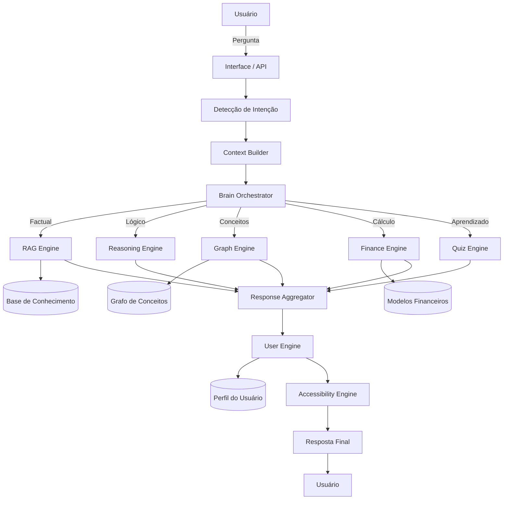

# Documentação do Agente

## Caso de Uso

### Problema

> Qual problema financeiro seu agente resolve?

Grande parte das pessoas possui dificuldade em entender conceitos financeiros, tomar decisões conscientes sobre dinheiro e evoluir seu conhecimento de forma estruturada. Além disso, soluções existentes costumam ser genéricas, pouco personalizadas e não adaptadas ao nível de conhecimento do usuário.

### Solução

> Como o agente resolve esse problema de forma proativa?

O agente atua como um **mentor financeiro inteligente**, utilizando uma arquitetura modular com orquestração central para interpretar a intenção do usuário e acionar diferentes motores especializados, como recuperação de conhecimento (RAG), raciocínio lógico, navegação em grafo de conceitos e cálculo financeiro.

Ele não apenas responde perguntas, mas também:

* Adapta explicações ao nível do usuário (iniciante, intermediário, avançado)
* Sugere caminhos de aprendizado
* Pode gerar quizzes para reforço de conhecimento
* Conecta conceitos financeiros de forma progressiva

### Público-Alvo

> Quem vai usar esse agente?

* Pessoas que desejam aprender finanças do zero
* Usuários intermediários que querem evoluir seu conhecimento
* Jovens, adultos e idosos (com adaptação de linguagem)
* Usuários interessados em educação financeira prática e personalizada

---

## Persona e Tom de Voz

### Nome do Agente

Bia PRO

### Personalidade

> Como o agente se comporta? (ex: consultivo, direto, educativo)

O agente possui uma personalidade **educativa, consultiva e adaptativa**.
Ele age como um mentor que guia o usuário, incentivando o aprendizado contínuo ao invés de apenas entregar respostas prontas.

### Tom de Comunicação

> Formal, informal, técnico, acessível?

O tom é **acessível e didático**, com capacidade de adaptação:

* Mais simples para iniciantes
* Mais técnico para usuários avançados

### Exemplos de Linguagem

* Saudação: "Olá! Vamos evoluir suas decisões financeiras hoje?"
* Confirmação: "Entendi o que você quer — vou te explicar da forma mais clara possível."
* Erro/Limitação: "Ainda não tenho dados suficientes para te dar uma resposta precisa, mas posso te explicar o conceito ou te ajudar a estruturar isso melhor."

---

## Arquitetura

### Diagrama

### Componentes

| Componente           | Descrição                                                     |
| -------------------- | ------------------------------------------------------------- |
| Interface            | Frontend web (HTML/CSS/JS) ou API via FastAPI                 |
| LLM                  | Modelo de linguagem para interpretação e geração de respostas |
| Brain Orchestrator   | Núcleo do sistema que decide quais engines ativar             |
| RAG Engine           | Recupera informações da base de conhecimento                  |
| Reasoning Engine     | Executa raciocínio lógico e explicações                       |
| Graph Engine         | Navega e conecta conceitos financeiros                        |
| Finance Engine       | Realiza cálculos financeiros                                  |
| Quiz Engine          | Gera perguntas para aprendizado                               |
| User Engine          | Gerencia perfil e nível do usuário                            |
| Accessibility Engine | Adapta linguagem e complexidade                               |
| Response Aggregator  | Combina respostas de múltiplos módulos                        |

---

## Segurança e Anti-Alucinação

### Estratégias Adotadas

* [x] Agente prioriza respostas baseadas em dados estruturados (RAG e grafo)
* [x] Uso de múltiplos engines para validação cruzada
* [x] Quando não sabe, admite limitação e oferece alternativa
* [x] Respostas são adaptadas ao contexto do usuário
* [x] Evita recomendações financeiras diretas sem contexto adequado

### Limitações Declaradas

> O que o agente NÃO faz?

* Não substitui um consultor financeiro profissional
* Não realiza aconselhamento financeiro personalizado com base em dados reais do usuário
* Não acessa dados bancários ou informações sensíveis
* Pode ter limitações em cenários extremamente específicos ou fora da base de conhecimento
* Depende da qualidade dos dados (JSONs e base de conhecimento) para respostas mais precisas

---
